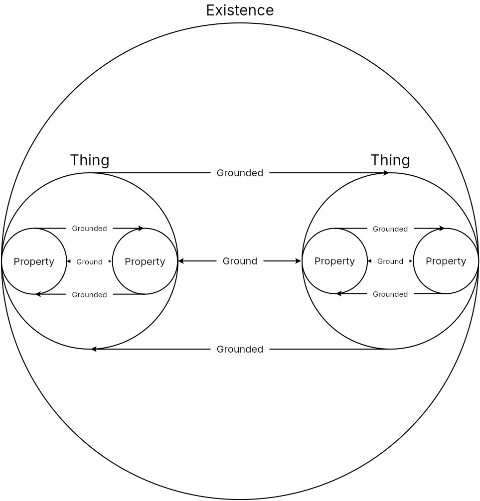
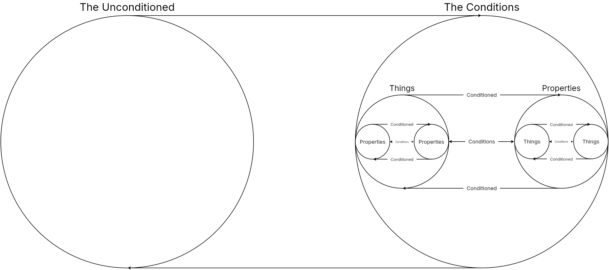
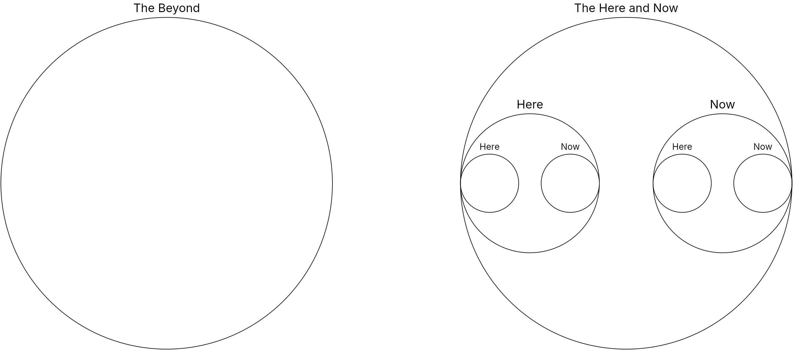

# Appearance

Note: This webpage is a translation of Karl Ludwig Michelet's *Encyclopedia Logic* (1876) 

Because essence is what appears, all its content is contained and presented in the appearance. But since the content of essence has become an appearance, the appearance becomes the very presentation of essence within itself. However, essence reasserts itself against the existence it stands behind, positing it as only being its appearance, so essence and appearance have excluded themselves from each other. Finally, the essence behind the appearance enters into the appearance, wherein essence and appearance become moments of the essential relation.

## Existence

Existence is the technically the third mode of being encountered so far. At first, being was entirely indeterminate and immediate. In presence, being did not lose its immediacy, but it became determinate. Like presence, existence is also determinate, but its immediacy is restored through the mediation of essence. We cannot attribute to existence the mere being of a determinacy since it determines itself out of the indeterminate and thereby contains its essence within itself. However, the prior contradictions of essence will eventually reappear in existence and entangle it in contradictions.

### The Thing

Existence, as the ground that has made itself into being, is the thing, the matter in which all forms exist. If one were to call this the thing-in-itself, this expression would have the error of being the basis of the phenomena behind it, whereas existence is precisely the basis and the phenomena taken together. Instead of a thing-in-itself, this is the thing existing in-and-for-itself.

### Properties

The qualities that appeared in existence as a otherness, in measure as ideal determinations, and in essence as forms, are now all moments of the thing, its properties. Because the property is grounded in the thing and is inseparably connected with the other properties, they no longer have an independent existence, but depend on the thing to exist. The thing is essential and the properties are inessential. The thing remains what it is, even if it loses one of its properties. But since the thing is simultaneously the totality of its properties, the properties also make the thing what it is, and when it loses them all, the thing ceases to be what it is. The thing therefore depends its properties, and without them, the thing is no-thing. Because of this independence the properties have from the thing, each property becomes a thing. Thus, the thing resolves itself into many properties, and only in this way is the multiplicity of things proven. Though as long as the properties are still contained in the thing, they cannot fully conceived as independent matters, nor can one be nested into the pores of another.

### Conditions

The contradiction that at one time the thing is the ground and the property the grounded, and at another time this relation is reversed, must now resolve itself. The resolution lies necessarily in the fact that the restored grounding relationship is at the same time a sublated one, it persists only partly, and not partly. Even if both the thing and the property appear reciprocally as the ground of the other, they ground each other in different senses of the word. The thing is the complete ground of its properties, it does not receive its determination by another, but contains all its properties within itself. The property, on the other hand, is the ground of the thing only in its connection with other properties. None in itself is the complete ground of the thing, each individual is therefore only a partial ground, and such a ground we call the condition, i.e. a partial ground.

## World of Appearance

Precisely because appearance has lost the impartiality of existence, which naively proceeded as if it contained essence with all its categories within itself, appearance has been reminded of essence as something other to it. Appearance is not an appearance of itself, but of essence. Because appearance is the appearance of essence, it also is something external to essence, and essence is also external to it. Essence is therefore a beyond or an other world that differs from this world. Appearance does not yet have essence within itself, but is only an appearance to it. The veiling of appearance behind appearance is the most extreme contradiction of logic because it inverts the difference between knowledge and illusion, creating a problem that is unanswerable because it has no answer. 

### The Otherworldly

The apparent justification that lies in the positing of a beyond, as the essence of appearance, is merely that the appearance as it initially exists is not the essence, which thus exists anywhere that is not in the appearance, i.e. beyond it. The category of a thing-in-itself, as opposed to appearances, is only here in its place.

### The Worldly

Even if, for the appearance, the otherworldly and the worldly partially fall apart, the otherworldly is nevertheless always contained within the appearance of the worldly. At every point, the being in the appearance is what the multiplicity of appearances have in common and is thus their unity. This beyond that has become this-worldly is the law, and as simple determinacy, it is the same content that the appearance displays in its infinite multiplicity.

### The Law of Appearance

Since in the law of appearance, the otherworldly has passed into the worldly, the beyond itself has appeared. Having appeared, the law has the content of appearance within itself. Essence has ceased to be merely in-itself or implicit, from which the multiplicity of appearances first had to develop. But even if law and appearance have multiplicity within themselves, this multiplicity is nevertheless different in each. The law has multiplicity itself as an essential element in-itself, containing only the simple, permanent moments of content, whereas in appearance, a multitude of inessential, changing contents are added to the permanent multiplicity, belonging only to the form of appearance. The law of celestial motion, for example, contains the same relationship between space and time for all celestial phenomena, which runs as the constant thread through the moment-changing position of the celestial bodies. Likewise, a code of laws determines a specific punishment for every crime, while the act in each individual case is filled with the most diverse content, to which the law is completely indifferent. The law is thus the undivided whole that remains the same in every aspect of its appearance, while the appearance, fragmented into infinite multiplicity, nevertheless contains the entire law in every part of its existence, no matter how small. But because the entire law has manifested itself in every part, the appearance is also the whole. It is divided into an essential and an inessential aspect, each of which is the same whole. This is the essential relation, to which we will immediately turn. 

## Essential Relation

Essence is now divided into two aspects that constitute its existence, essence itself and its appearance, which are nevertheless essentially related to one another. In this relation, there is a totality of determinations in being that are emanations of one immanent determination in essence. What is in essence is opposite to the external appearances in being, but only such that the same content reveals itself only in a different form.

### Whole and Parts

Since the law exists completely in every aspect of the appearance, it is in fact the whole which encompasses the multiplicity of the appearance as its parts, and yet at the same time relates to each individual part with complete indifference. If we think of the parts as a unity, we have the whole, and if we think the whole as a fragmented multiplicity, we have the parts. Both aspects are no longer external to each other, but have the very same content, differing only in the form of unity and multiplicity, to which each aspect remains indifferent. The whole seems indifferent to the parts in that it is not partitioned and the parts seem indifferent to the whole in that they are not connected. But this indifference, precisely because each are identical in content, is only an illusion. The whole is only the whole because it does not lack even the smallest part, e.g. the gears of a clock stop when even the smallest pin has failed. Every part, no matter how irrelevant it might seem, is a condition or partial ground of the whole. Conversely, since something is only a part if it belongs to a whole, the concept of parts presupposes the whole. However, the parts have this as their total condition, or sufficient ground. The relationship of ground is thus restored at the same time as the reversed relationship of conditioning has reversed its reversal. Namely, since each side is ground and grounded, conditioning and conditioned, the relationship of the whole and the parts appears self-conditioned. For all parts taken together ground the whole just as the whole grounds all parts because they both are one and the same. If each side is separated, then precisely in the very act of separation does each side transform into the other. For if a part is isolated as if it did not belong to a whole, then precisely by ceasing to be a part it becomes a whole itself. However, as a whole, it must also have parts, and so on. Hence, the whole is contained in even the smallest, most immediate part. But the essential relation is no longer passive or seemingly indifferent, but actively and automatically generates its other.

### Force and Expression

That the whole appears as the active form to its parts is the relationship of force to its expression. With force, it clearly becomes apparent that essence is immanent in the appearance, e.g. the sun's gravitational pull appears to act on the earth from outside, but it can only do so because it simultaneously influences the earth's own gravitational pull. Force acts from within, yet it also must have something to force or be the force of. The force exerts its activity on what it forces, and in it, it expresses itself. Since force is only a force if it expresses itself, force is already implicit in the expression that force makes explicit. The expression is therefore the force that forces force. Though the expression is excluded from force, this act of exclusion is what makes the force the expression of expression and the expression the force of force. Force and expression are each forces in forcing the other out of itself and so are at the same time expressions of the other.

In the interplay of forces, each side of the essential relationship, the force and the expression, has in turn become the whole. Its formative moments are linked as inner and outer moments of reflection, independent aspects that are opposed to one another, yet each of them is simultaneously what the other is. The positive expresses itself only when it is solicited by negative and vice versa, both are merely the aspects of a self-related activity, and thus of an identity that distinguishes itself into its moments. Force is a unity regardless of the duality of the expressions that emerge from it. Likewise, force has the same content as the expression, between the two there is only a difference of form, and this is precisely the relationship of the inner and outer.

### Inner and Outer

In the relationship of the inner and the outer, the force has made itself its expression, and since the whole force is contained in the expression, we now have the completed result of the process where essence pervades both forms of the inner and the outer. This identity of the inner and the outer already provides a good definition of truth, for it is the beginning of dissolution of analytic one-sidedness. Since in truth, inner and outer have the same content, but are distinguished only in form, the false differs from truth in that in both forms are completely different in content, e.g. in hypocrisy, where someone does something completely different from what they say. However, it is also possible that the true content is present only in one form and not in the other because the true content has yet to appear or manifest in the other. Here the two forms form a contrast only as such, not through their content, but inevitably transform into one another with in time, e.g. the use of reason is initially only implicit in children which eventually becomes explicit with education and self-instruction. 

It can also be seen quite clearly from this change of form how the transcendent, which should be something merely external to appearance, only appears as something purely inner or implicit. But if what is posited in one determinacy is simultaneously posited in the other, then the apparent difference of form has been abolished. Whereas the content has become unified again as that which is identical in both forms, expressing itself in all of them. With this, the concept of the essential relationship has actually already been dissolved since the inner and outer are the same, these two totalities are now one totality. This is the category of actuality, in which essence and appearance are absolutely identical.

