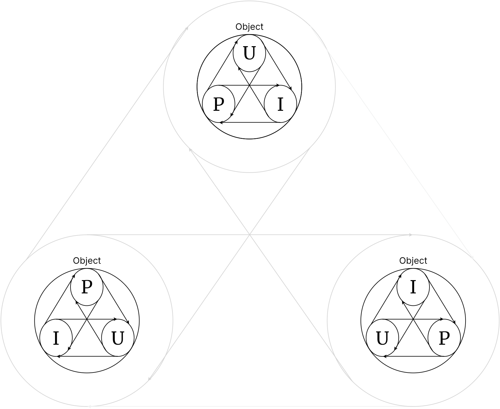
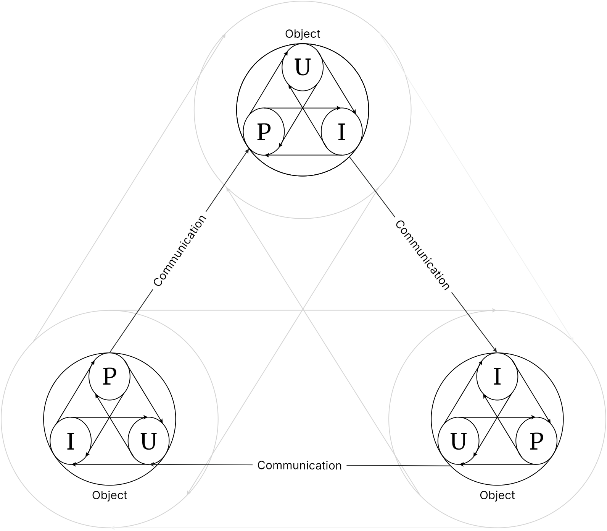
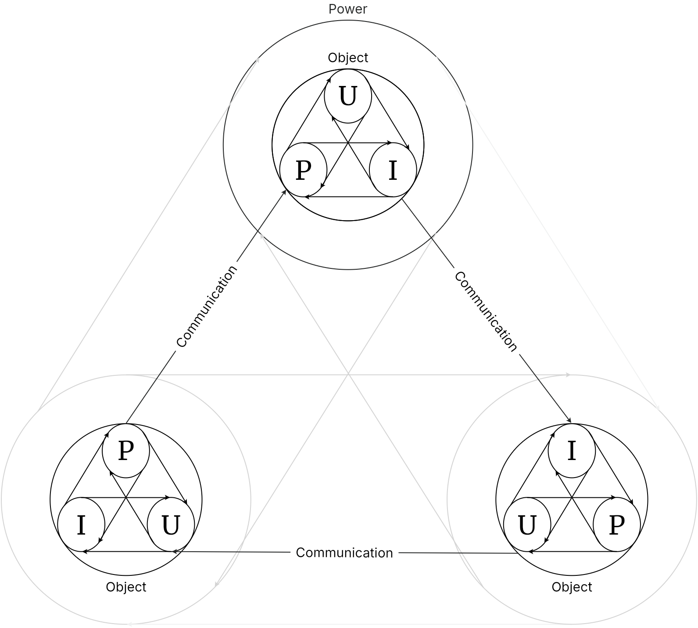
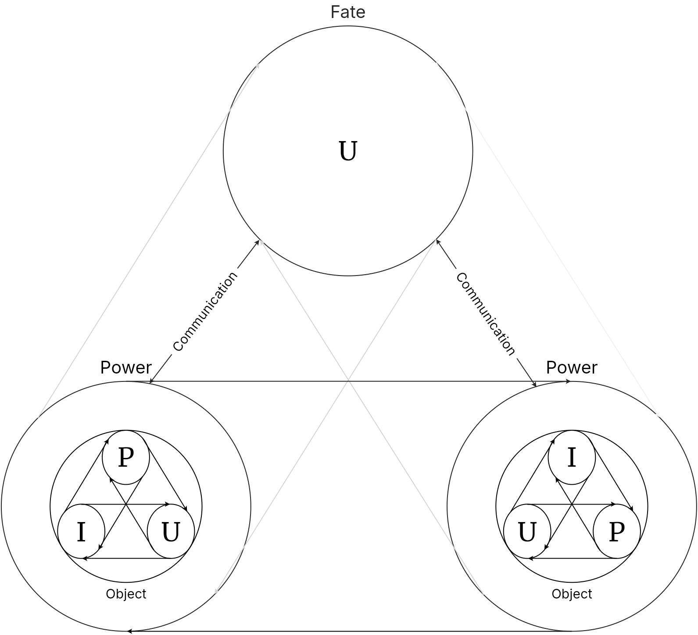
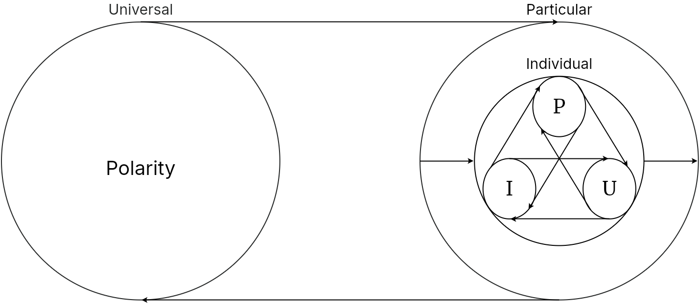
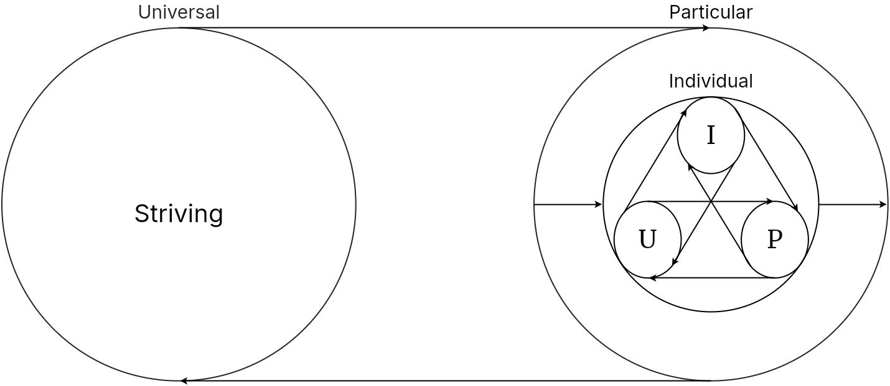
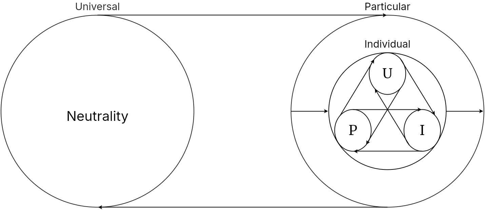
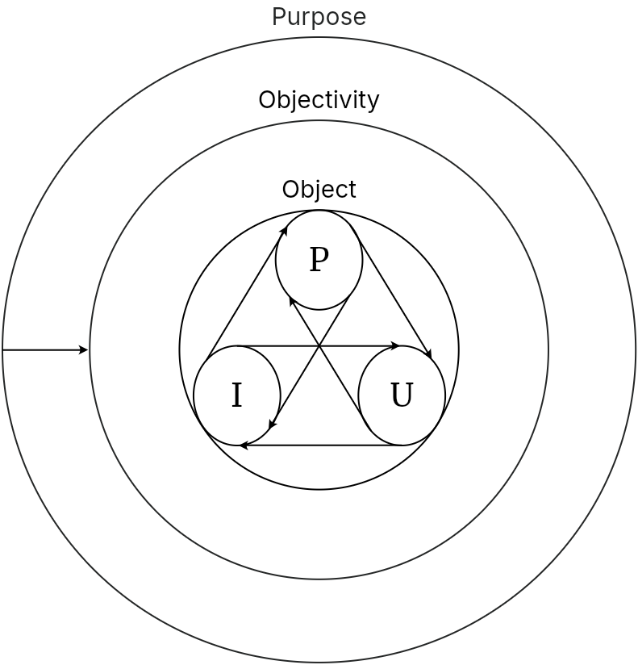
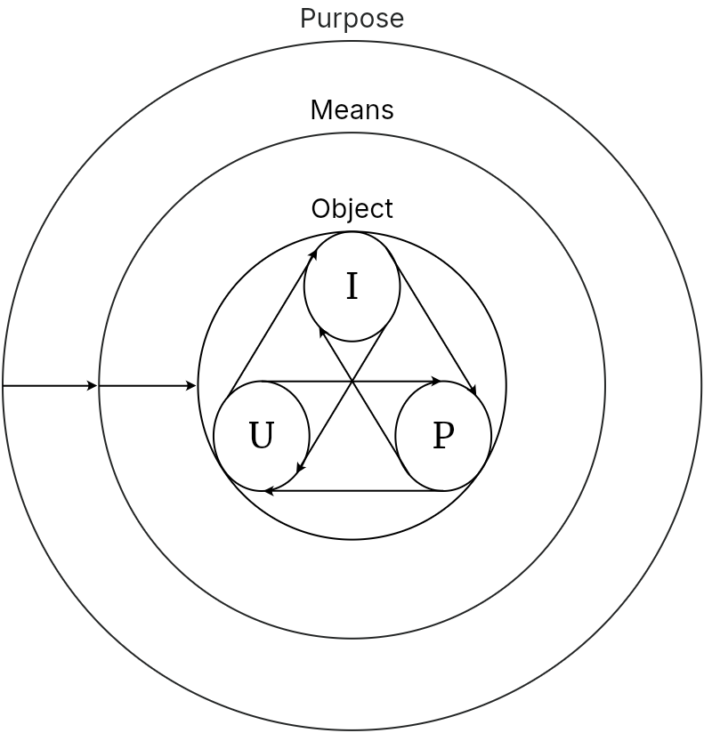

# Objectivity

Note: This webpage is a direct translation of Karl Ludwig Michelet's *Encyclopedia Logic* (1876) 

Since individuality now has the total development of the concept within itself, it has arrived from the potential of universal subjectivity to the actuality of isolated objectivity. Because each individuality is the whole concept, it has on the one hand, has not lost itself in objectivity, but on the other hand, has not yet achieved the reality adequate to it. This is because the unifying bond of universal subjectivity had to be abolished for the individual objects to diverge into the absolute independence of their being. Though, because it has also preserved itself in becoming absolutely independent, its progress now consists in the fact that what was previously only presupposed as its conditions, being and essence, have now been completely defined as necessary moments of the concept's self-definition. 

With the transition of the concept into the object, being has at last revealed itself for a fifth time. The first, indeterminate and immediate being had, secondly, determined itself within its immediacy as existence. Third, being arose from essence as existence mediated by essence or essential existence. Fourth, it had risen in actuality to identical with essence, until it has finally been posited as an object in the proper determination of the concept, which must traverse the entire circle of its moments to realize its unity as the idea, in which reality has become adequate to the concept.

The object must therefore first complete itself, and to this end it must develop opposite to that of the concept. Whereas the concept descended into the object from universality to individuality, the object must now ascend into the concept from individuality to universality to become the idea. The dialectical movement of the object first expresses its indifference to the concept by relating to other objects only externally in mechanism or mechanical objectivity. Though since the concept is, secondly, within each object, their indifferent separation is abolished by having certain affinities towards other objects in chemism or chemical objectivity. Finally, the concept purposes the object as a means to realize itself objectively in teleology.

## Mechanism

Objectivity initially appears as a mechanism because each object, as the whole concept, is defined by itself and so is indifferent to other objects. The mechanism is therefore a kind of inference, namely, the quantitative one, precisely because the distinction between objects has been abolished. But instead of concerning only universality in the formula U-U-U, the entire content of universality and particularity is posited as identical within the individual objects themselves, reflected in the formula I-I-I. The individuals appear only as an indeterminate set of terms external to one another. And because the amount of terms are undefined, the conclusion can be continued indefinitely, since each individual always has another individual external to itself. The course of the mechanism can be no other than that the objects pass from their at first stationary relationship of indifference to communication, engaging secondly in the struggle of external power against one another, and thirdly, returning from this opposition to a reconciled unity, as fate.

### Communication

Since each object is the entire concept, existing apart from one another in complete inactivity and independence, they initially do not concern themselves with or influence one another. The whole field of objects is like an ocean in a calm wind, where every drop of water merges and rest with the whole. But since the total concept, as the self-separating and isolating universality that takes place in every object, the change that occurs at one point is a change that spreads to all points, which is communication. No wave can ripple and no stone can be thrown into the ocean without the ripples of water propagating from shore to shore. However, since the individuals are all instances of one and the same concept, they cannot be qualitatively differentiated from each other and the only possibility that remains is quantitative difference. The communicated universal is distributed differently among the individuals because they are different entities relative to one another and in distribution, the process of communication reverts to its original inactivity.

### Power

Because of the quantitative difference that the objects retain with respect to one another, the communication and distribution enacted on them will also appear as the unequal influence of one on the other. The active object influences the passive object that receives its influence. In this respect, the relationship of causality has been restored. Resistance is the power that a stronger object receives from a weaker one while at the same time being inhibited by the greater power, whereas the impact is the power to which a weaker object is subjected by a stronger one, while at the same time is carried with it. The causal relationship has thereby achieved the full identity of its members, since activity and reactivity are common to both, thus eliminating the need for them to identify with each other to the point of rigid inactivity or balance. Action and reaction always remain the same in their interaction, and power is only as great as the resistance it encounters. 

In this way, mechanism no longer remains an infinite series of particulars, as the mere reflection of objects into each other. The judgment I-P is restored in that the stronger object appears to the weaker object as the predicate under which the subject is subsumed. The infinite progression of mechanism, however, still remains. For since quantity knows no greatest and no smallest, there is no power, however great, that cannot be overcome by an even greater power, just as there is no power, however small, that cannot overcome an even weaker power. As we at first had the progression of individual concepts in which the individuals endlessly determine other individuals in series: I1 is I2 is I3 and so on. Now, we have an infinity of judgments, in which every subject can become the predicate of a weaker subject, every predicate the subject of a stronger predicate: I1 is P1 is I2 is P2 is I3 is P3 and so on. We thus have an infinite series in which every I becomes a P by exerting power downwards, and every P becomes an I by enduring power from above. Thus, subjects become predicates in the descending series, and predicates become subjects in the ascending series. To the extent that each term, as a middle term, refers to a higher and a lower term, all three terms have each themselves become a terminus minor, medius, and major. With this, the mechanical judgment has passed into the mechanical inference I-P-U, in which the externality of the relationship begins to melt away, since the impact that each object receives is its own, which it also inflicts on the other object. The universality of the concept is the active power that determines all the elements of the relationship towards itself.

### Fate

The power that is immanent in mechanical objects is fate. It is the fate of the object that its own essence as the concept appears external to it as an alien power, that in determining the action of another object its action is also determined by the object it determined the action of. Fate is the universal power of mechanism, which is internally fulfilled in each mechanical object, even when they appear to act and are acted upon externally. But with this conclusion, power ceases to act mechanically since it is now the inner determination of the object, which also encounters corresponding power in the object opposed to it. Therefore, two objects that are explicitly different and implicitly identical now strive to unite with each other to restore the totality of the concept, which had been lost through the exclusivity the objects established in mechanism. The objects are no longer relate to each other mechanically, but are now related chemically.

## Dynamism

Dynamism is the contradiction that, because the conceptual determination of objects are initially only internal to them, it still relates to different objects as something external to them. It is their immanent determination to define itself by its relation to the other. Though the concept has its appearance in the individual objects, they are still separated and so do not fully correspond to it yet. The abolition of this separation manifests firstly in the polarity of chemical objects, secondly, in the process of striving to complete each other because they are what the other lacks, and finally, in the neutral product of their activity.

### Polarity 

While mechanism first generated the opposition of objects in its development, chemism immediately begins with it. Namely, since one object was active and the other passive, one U and the other I, the quantitative difference of mechanism has become a qualitative difference in chemism. However, the chemical objects are not only different from one another, but also have difference within themselves. Each forms the judgment I-U, but each also has within itself this original division, having activity and passivity simultaneously within themselves. The power of each object acts on the other, and thus each object is in-itself the entire concept. Though the differentiation of the object into polarities is established through the second figure (U-I-P), it nevertheless passes through all three figures. The chemical object itself takes the form of the first figure (I-P-U) because the kind of object constitutes its nature, i.e. only as the potential but unrealized unity of the extremes, which in this respect is still external to them. Chemical reactions are the most immediate example of this. The precondition of this process is a passive base (U) and an active acid (I), both of which are determined to act upon each other, and whose external bond (P) is an elementary state of matter that coexists alongside its internal bond, the kind or chemical species. As a totality existing in itself, the external bond is the medium in which the opposites of the extremes differentiate themselves and bring their specific differences into existence within it. 

### Striving 

As the separated objects now strive to establish the totality that they are in themselves, each one influencing the other through its inherent power, the chemical process begins to abolish the separation and exclusivity that defines the objects. As each is distinguished within itself by its polarity, it is also identical with the other through this distinction, and so each strives to realize the completion of themselves in the other. Thus, they stand together as chemical objects (P) on one side, as extremes within a universal medium (U) on the other side, and as moments of the chemical process (I) that unites the two according to the second figure (U-I-P).

### Neutrality

However, since in the completed activity the different objects (P) are united with one another through the universal medium (U), neutralize their striving in forming a neutral product. Their different qualities, completely merged with one another and produced something completely different from what they were originally. The neutral product is therefore the true universality of the genus or kind (U), which now becomes the total center of the third figure (P-U-I). The true universal disjunctively separates itself into its extremes I and P as the different objects from which it was constucted as its conditions, and which are proven to be just as much its products as they are its presuppositions. The totality is therefore that which posits its presuppositions. This disjunctive inference of the third figure now has its actual example in the chemical process by which a salt is formed from a base and acid. 

Since the totality of the concept is also restored as existing in this center, but only one term of the whole inference that still opposes the others, subjectivity reappears out of objectivity. However, subjectivity reappears in such a way that it includes objectivity within itself, but only as something that is simultaneously related to them externally and realizes itself in them. This is the object of teleology, because the concept that strives for realization in external objects is their purpose.

## Teleology

Even having deduced external purposiveness from chemism, however, it has already been posited that the concept strives to abolish its externality, returning to itself in the object to become the immanent purpose of it. To the extent that it reaches this at the end of its path, however, it still belongs to objectivity as something external to the object. Purpose begins as an abstraction alienated from itself, utilizes the object as a means in order to make itself objective, through this mediation, the realizes itself as a purpose. In the inference of purpose, each term itself a complete inference, and teleology is thus an inference of inferences according to each of the three figures.

### Abstract Purpose

Since the purpose, as the total concept that has returned to its formative unity within itself, still stands opposite to the mechanical and chemical objects as the material for its realization, the finitude of the purpose inheres in the externality of subjectivity and objectivity. Furthermore, since the purpose is an objective that is external to other objects, it is also finite in terms of its content. However, these two aspects of finitude are once again one and the same. For the form of the purpose falling apart into the opposition of subjectivity and objectivity stems from the determinacy of its content, and this deficient content is in turn rooted in the deficiency of its form.

Typically, abstract purposes are conceived of and originate in consciousness, since in consciousness a subject relates to an object outside itself in order to realize its ideas in it, such as a builder who imagines the house before building it. However, the abstract purposes exist in the world independently of the conscious beings that cognize them, such as the niche of an animal, the growth of a plant towards sunlight, etc. The inference of abstract purpose (I-P-U), consists in the fact that it exists for-itself in an individual object (I), unfolds its content within itself as a series of particular moments (P) and thus seeks to encompass the universe (U) of objects it describes (and the same inference is reversed when the abstract purpose originates in the subject). The meaning of the inference of the subjective purpose in the above-mentioned example of the builder is that they carry in their mind the general outline of the house as a universal (U). This abstract universality, however, is self-fulfilling. The builder consciously goes through all the different materials (P) they want to use in build the house. When they have made the entire scope of particularity clear to themselves, i.e. discovered it to be realizable (U is P), then they decide to proceed to action through objectivity (P is I). From both premises follows the conclusion (U is I), that the universality of the subject is instantiated in the individuality of the object. This however also expresses the other formula of the conclusion (I is U), because the builder's purpose exits their individual subjectivity to pass into the general realm of objects. 

The externality between purpose and object, which precisely constitutes the finiteness of purposiveness, is supposed to be abolished by finite purposiveness itself since the purpose only proves that it is purpose in being realized as a purpose. But this means nothing else than allowing the dissolution of finitude and opposition to form a new opposition. In this form of particularity, as the center of the first inference, the determinate content of the purpose contains the mediation between the abstract universality of the purpose and the individuality of the external object. Encompassing both extremes, the middle is both an object and has the purpose immediately within itself: it is a means. The moments of the content of the end, to build a house, the stones, the wood, etc., are the means by which the end is realized. It is the conclusion of the first figure, I is U, that has this meaning. The individual object is now universal because it is directed towards a universal end, and so it forms the active middle between the abstract universality of purpose / end and the particular objects used as a means. Teleology has entered the second inference, U-I-P (or P-I-U), where the end that is is not yet realized, is conceived as particular to the other extreme, which is universal objectivity.

### Means

Because in the inference of the means, as the second figure, the middle is both the object that promotes the end and the purposive activity of the subject, it appears as broken down into subject and object, while the extremes are only one or the other. Since both extremes thus appear in the middle, the inference is an inference of reflection: the subjective end is subsumed by the activity just as the external means is subsumed by the world of objects or vice versa. But the end requires a means because of its finitude: in form, because it is external to the object, and in content, because its determinacy does not yet belong to it, but to the object to which it is related. This syllogism therefore has two premises: the universal, subjective concept that is set in motion (U is I), the object, in which the subjectivity of the purpose is inherent (I is P), which is purposed by the concept as a means to realize itself (U is P), and to which the object is used by the purpose (P is U). The means, however, is external to both the purpose and the object, and is therefore only a mechanical object. Because of this indifference, there are more than one means that could be purposed by the purpose. For instance, a house could be built out of different materials, and hunger could be satisfied by different foods. The means relates to the object external to it in order to transform the object by imposing its purpose on it, using it until it can no longer be used as a means, possibly wearing it out or even destroying it in the process. But since the means is itself inflicted by the same power that it inflicts, it is also used until it is altered, worn out or destroyed, whereas the purpose is preserved through the entire process of negation. 

Since not only end and means in the first premise, but also means and object in the second, are contingent upon one another, it is for this reason that any another means is suitable to mediate the end and the object and that a new means can always take the place of the old. For the means to be able to impose the purpose on the object, this requires a new mediation in which the first means gives rise to a second means, and so on. To this endless series of means, however, there is also a corresponding series of ends. Through the mediation of the purposed means, the object seems to have become an end itself, because the end has been communicated to it. Thus, the object that has become an end is higher than that of a means. But because the object always remains in relation to the end and is determinate in content, this end is only an efficient cause, not a final one.

We seem unable to progress beyond the standpoint of external teleology. The object that has become a factor serves only, as a means, which is also a higher end, and so on. On the one side, there is an endless progression of ends, while on the other side, there is an endless regression of means. Since a new means always forced itself between the end and each means, so in the second, a new object is always added to each object, which becomes a higher end. Both developments are, however, one and the same, since the first means, in relation to the new, becomes an end, just as the first object, in relation to the new means. The discovery of this endless progression in external purposiveness is proof that it contradicts itself and moves toward its resolution. If the end is a means, and the means in turn is an end, then even here the end has already shed its subjectivity to the extent that it has realized itself through its means and in its objects: i.e. the end is in objectivity itself and is therefore realized.

### Realized Purpose

In the realized purpose, the universality of purpose (U) is now the mean between the subject (P) and the object (I), which is the syllogism of the third figure (P-U-I). This is indeed a syllogism of necessity, in which the mean, is the totality or subject-object. Though because purposiveness is still external, this relationship belongs more to the side of objectivity. The realized purpose has applied the means to the object, and through the means has asserted itself as the purpose, demonstrating that the purpose, means, end, and object are all interconnected. The purpose disjoins itself into its extremes, simultaneously paving the way for merging the external objectivity of teleology with subjectivity of the concept. Since we have seen that the end itself had become a means, it produces a new, higher end through its own activity, which in turn becomes as a means serves to produce another higher end in bread, and so on until the ultimate end is realized as the final cause. In this, every opposition between end, means, and object is abolished. For the end is precisely the self-consistent content that pervades the means, and the external object at the same time preserved in them. Since the subjectivity of the end has become objective, and the objectivity of the means and the object has become subjective, the externality of the end and the object to each other is also abolished. 

The realized purpose (U) is an object that encompasses the entire concept, and in which the formal activity of the objectifying subjectivity has itself as its content. Precisely because the concept had lost itself in its presupposed object, it now arrives at itself in it. The appearance of externality is abolished by the activity itself, since the purpose now breaks through as the object's own inwardness, which also presents itself externally in it. This is internal purposiveness, in contrast to external purposiveness. Because objects are already in and of themselves the totality of the concept, the activity of the concept is already immanent in them. They possess within themselves the reason of purpose, and have within themselves the power to maintain their existence, to develop themselves purposefully. In short, they have become an end in itself. Each side has therefore become the creator of the other. We therefore have their reciprocity, in which the process and result of creation are identical, the perfect unity of which is the Idea.