# Quality

Note: This webpage is a direct translation of Karl Ludwig Michelet's *Encyclopedia Logic* (1876) 

As pure being, being has not yet developed the opposition from within itself, but is only indeterminate being. But second, by generating this opposition within itself, one being stands opposite another, and this multiplicity of being we call presence or determinate being. Third, existing beings return from this dichotomy back to the oneness of being. The simplicity of being that restores itself through multiplicity, through which it is with itself in the other, is being-for-itself.

## Pure Being

### Being

Whether we begin here or there, with the subjective or objective, we leave entirely undecided, because we neither yet know the opposition between subject and object, since these terms are completely unknown to us. We can neither affirm nor deny that the knowledge of the beginning is not the beginning itself. Whether being is ideal or real we do not yet know, because the distinction between being and thinking cannot yet be made at the beginning. If we presupposed this distinction, then we would have already recognized them as two concepts, and that would be more than an immediate beginning. Therefore it is even wrong to begin with a method for thinking and to attempt to derive being from it. Difference cannot be asserted here just as well as identity cannot be asserted since this identity also presupposes the opposition of both sides. Even if being is inherent in everything that begins, it nevertheless lacks, as we remain strictly at the beginning, any further determination, since such a determination would already be more than a mere beginning. Pure being does not need to be proven because proof requires mediation, but being finds itself immediately in thinking as pure thought and nothing more, even in the absence of our knowing that this being is a thought.

Since there is nothing in heaven and on earth from which one could think away being, nothing so neglected by nature that it lacks any determination, then it is being and not thinking that is the first category, the most undeveloped, most general definition of truth. With it, we are already in philosophy, because it immediately places us in the standpoint of truth, although still very much veiled. We have no business assuming what truth is because all we can do let the truth explain and develop itself, just as a tree grows from a seed. At the beginning, of course, we still do not know much about truth when we designate it as being, in fact, we only have knowledge that it is, not of what it is. In any case, the determination of being does not belong to the absolute principle as a predicate that would be attributed to a subject existing outside of this predicate. Instead, the predicate is the true substance of the subject itself, and the principle at this level is nothing but being itself. 

If the pure being of the beginning, as that which is still completely undetermined, is determined by its lack of content, then it is not as immediate as it initially appeared. For in order to think pure being, we must abstract and exclude all determinate content from it. Abstract or universal being is only attainable through the negation of every single concrete being. As the indeterminate, being is mediated by the determinate, namely, through the negation of all its determinations. Thus, instead of being the immediate, it pure being proves itself to be absolutely mediated, it proves to be the absolutely negative. In other words, pure being is nothing, precisely because it lacks all content.

### Nothing

There is no grammatical, much less a factual, distinction between nothing and non-being. Nothing is not anything, i.e. not a being. Accordingly, it is even arguable that we could have very well began with nothing and not with being. Indeed, if we presuppose nothing, then nothing would be absolute presuppositionlessness itself. But if nothing is a better beginning than being, then it is precisely this assumption that nothing is not the most immediate beginning. Nothing is, after all, the recognition of being's own lack. It is the complete negation of the presupposition of being. And to be able to negate this presupposition, it must have preceded it. Nothing cannot therefore be thought without being, it necessarily contains both, whereas being only contains itself and nothing else. Nothing is not the beginning because it is already mediated by the thought of being and arises only from our recognizing the thought of the lack in being. Since what was only immediately present in being is thus posited in nothing, the difference between the two was already presupposed by being. Each successive moment always differs from the previous in that what follows makes explicit what was already implicit in what came before.

In holding nothing for itself as separate from being, the question could be raised whether nothing, like being, is the truth of all things, i.e. that reality is nothing. If dialectic is only a point of transition between hidden and contextual opposition, then it can only be considered a moment of the complete truth from a subordinate, one-sided standpoint. It is certainly a correct to say that dialectic exposes and refutes positions that presuppose their opposite, but this does not tell us anything positive about the truth itself, only that the negation of incoherence is necessary for truth. The only wrong approach is to apply nothing to the truth if it is intended to determine on the positive nature of the truth in itself, i.e. that there is no truth. The negative is simply a transition point in order to arrive at the unity of opposites.

We can no more admit the absoluteness of nothing than the absoluteness of being both arise only from a one-sided view of the understanding. Just as we attained being through the negation of every determination, so nothing arose for us through the same procedure. Nothing is not merely a thought in general, it is the same thought that was recognized in being. Being and thinking are as inherently connected in nothing as they are in being. Being can be demonstrated in the real world just as little as nothing, they are both the same abstraction. Nothing is therefore being. Being proved nothing, now nothing has proved being. This line of argument, however, does not merely have the meaning of a positive justification of one concept by the other. By mutually negating each other in their one-sidedness, each not only disappears into the other, but both return to the third category that connects them and is their source. Though this connection is by no means a stable result, since being and nothing still constantly transform into one another. This restless transformation of being and nothing into one another is becoming.

### Becoming

The absolute contradiction, that being and nothing are the same, opposed and constantly transform into one another, is established a priori by the necessity of dialectics. But even if we were mistaken in believing that becoming is the category that satisfies this requirement, this would not yet overturn this speculative result, we would only have to seek another word that more accurately captures its meaning. But among the words familiar to us, that Becoming alone fulfills the requirement is clear. In fact, it is so, for that which becomes already is, but equally, it is also not yet what it is to become. In a word, that which becomes is an existing non-being and a non-existing being, and both elements of becoming are so intimately interpenetrated that they cannot be separated.

Every further step advanced, every subsequent category, will contain the same unity of these original opposites only in an ever richer form, and thus, from the beginning, the truth will appear ever more clearly and definitely. Not as static, dead being, nor mere as annihilation, but as the eternal flow of becoming, everything that is and is not. But their being and their non-being are also separate from each other: their being is also not their non-being, their non-being is not their being. By accusing philosophy of the nonsense of only wanting to maintain the inseparability of being and non-being, without also admitting their difference, reason then has an easy time taking such a claim as its target and unearthing new contradictions that we already thought we had disposed of. When unphilosophy concludes from such a supposed identity of being and non-being that it is indifferent whether the being is or is not, the interest of the question is shifted away from these simple categories and toward the determinate content. The unity of being and nothing is thus nothing other than the general unity of being and nothing that pervades all individual things. 

There is no immemorial, calm being from which an ever-changing being once emerged with the content remaining the same. Every being that emerged from a nothing already has within itself the nothing into which it will perish, just as the nothing that conceives being from itself has itself already been conceived from being. There has never been a time where only being, nor ever a time where only nothing existed, but at all times, the eternal cycle of these opposites have always existed within each other. Because neither being nor nothing exists in becoming for themselves, we can say that they are sublated in it. Each is precisely only as it is not in the other, but only becomes, moves. They are each the mover and driver of the other—in short, they are what one calls moments. Every opposite exists in the other as a moment, as its mover. If, therefore, being is a moment of nothing at one time, and nothing a moment of being at another, it also follows that they are both moments of becoming. 

## Presence

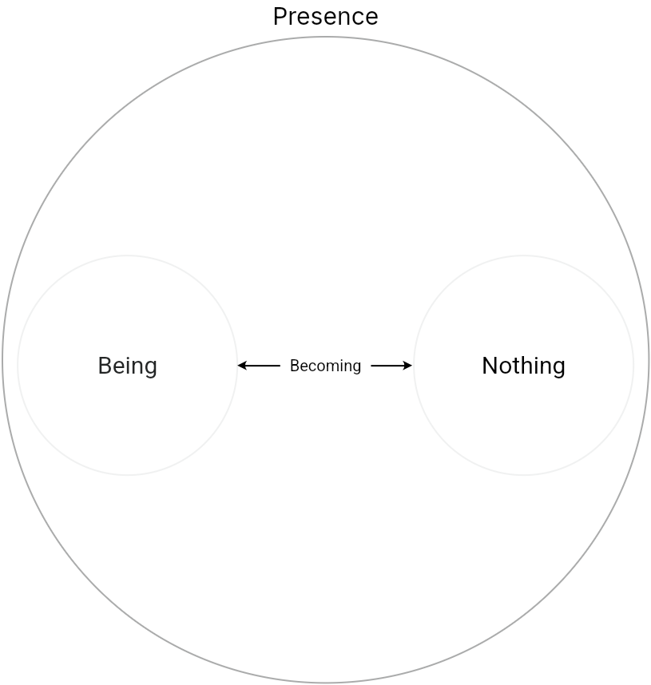

In becoming, that which has come into being, as a being mediated by a non-being, is both as well as neither. This contradiction is only resolved by excluding that being from it, since it is this being, namely the being from which it came into being. Such a being that stands apart from non-being is called presence, which is likewise opposed to absence. A being is here, and not there. Presence in general is a being that is this and not that. From the moments contained in presence, the positive side is reality, the negative side is determinateness, and the unity of both sides is infinity.

### Reality

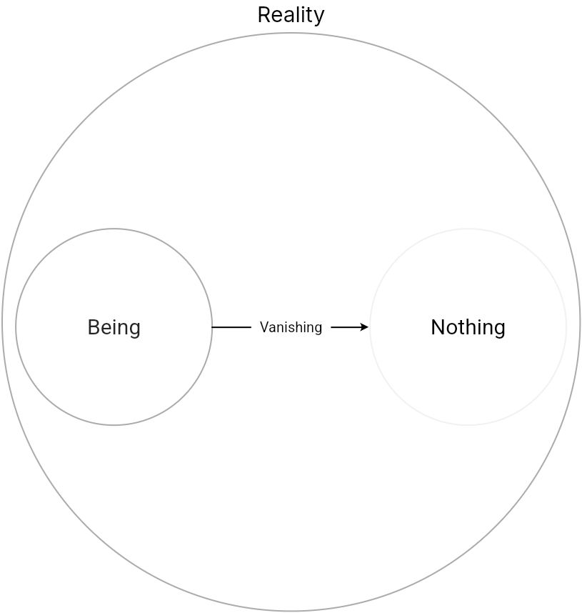
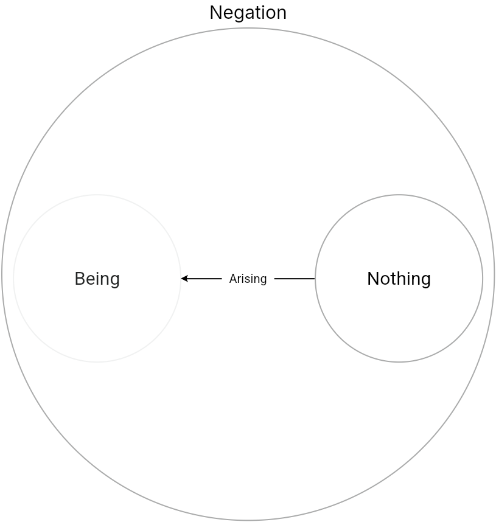
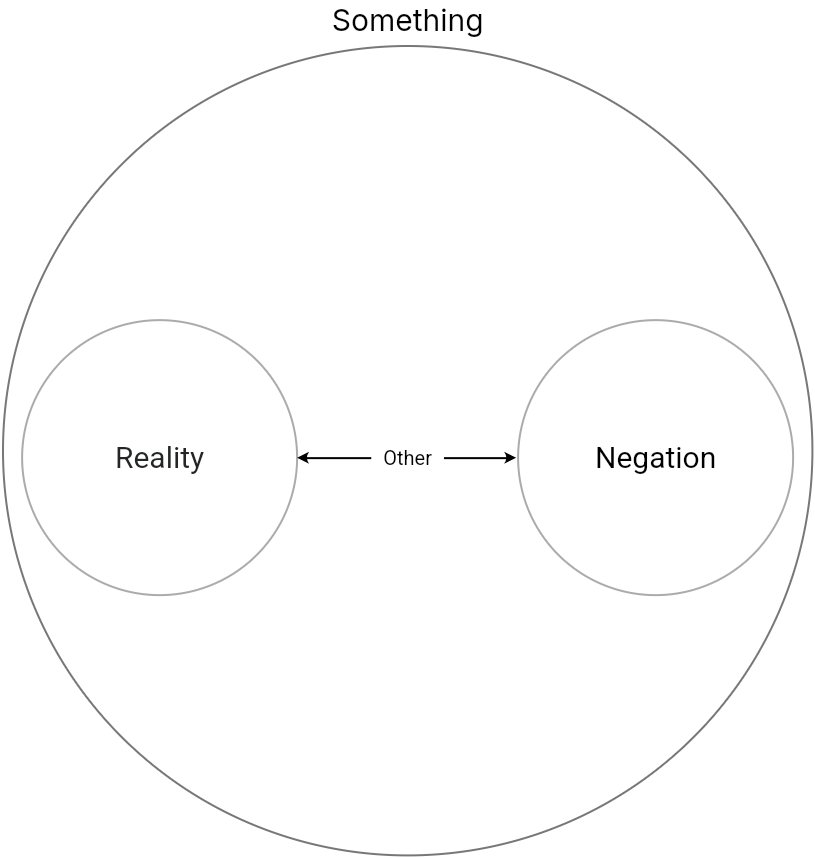

If reality is the positive side of presence, then the question could be raised as to how it differs from being. After all, it is a being that exists. Pure being, indeterminate being, is not real precisely because it is a mere abstraction. Only through the inclusion of non-being does it acquire reality. For what is being is only as far as non-being is not. Reality is therefore only real through negation. 

#### Something

Presence is neither the fullness of being nor indeterminate being, but is this being excluded from that being, a something. In something lies etymologically the concept of the partition, as some being that is not another being. The Scholastics called this quidditas or "thisness", and only through the quality of being a this is something a reality. It is therefore erroneous to see only being in something, and those who want to replace the opposition between being and nothing with that between nothing and something are wrong. To be something is to be defined by negation. Something cannot be the pure opposite of nothing, since it already includes nothing within itself as non-being.

#### Other 

The opposition something has within itself is that it is a presence mediated by a absence. But this absence, however, is itself a presence. The non-being that is in something is not a pure nothing, but is a non-being unified with being. The absence in something is thus an existent absence, an other. As the same unity of being and nothing, the other is still at the same time a something, and something is also an other, i.e. the other of the other, they are each an other to one another. On the side of being within the something, this is its being-in-itself. Something is in-itself this something, and that excludes it from the other. On the side of non-being, however, something is also defined by its negation, its other, in-itself. And as being is related to the other it is its being-for-other. presence and absence, something and other, are in turn the same in that each has the other within it. Something is not something other than what it is for the other, rather, its being-in-itself is its being-for-other. What it is merely in-itself is an empty nothing and is only real when it is for an other.

#### Finitude

Since something in-itself is for something else, its being is determined by what is other to it, its non-being. Where that otherness begins, this otherness ends. The something is therefore finite, and since the other also finds its end in something, it is likewise finite. Both, in turn, are the same. With the category of finitude, reality has reached its complete concept. 

### Determinacy

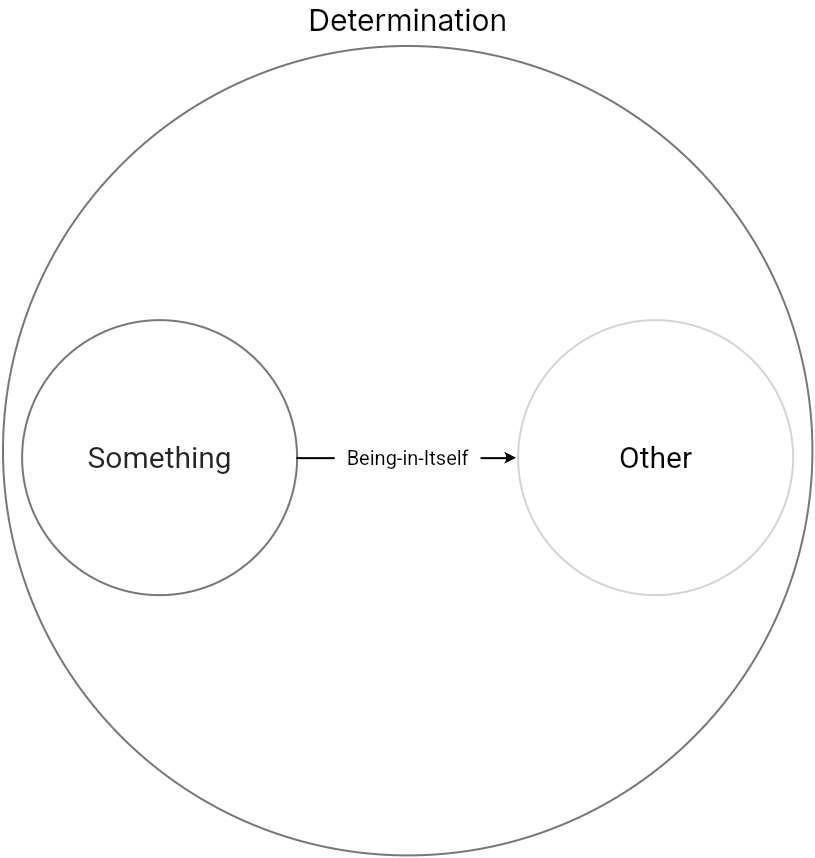
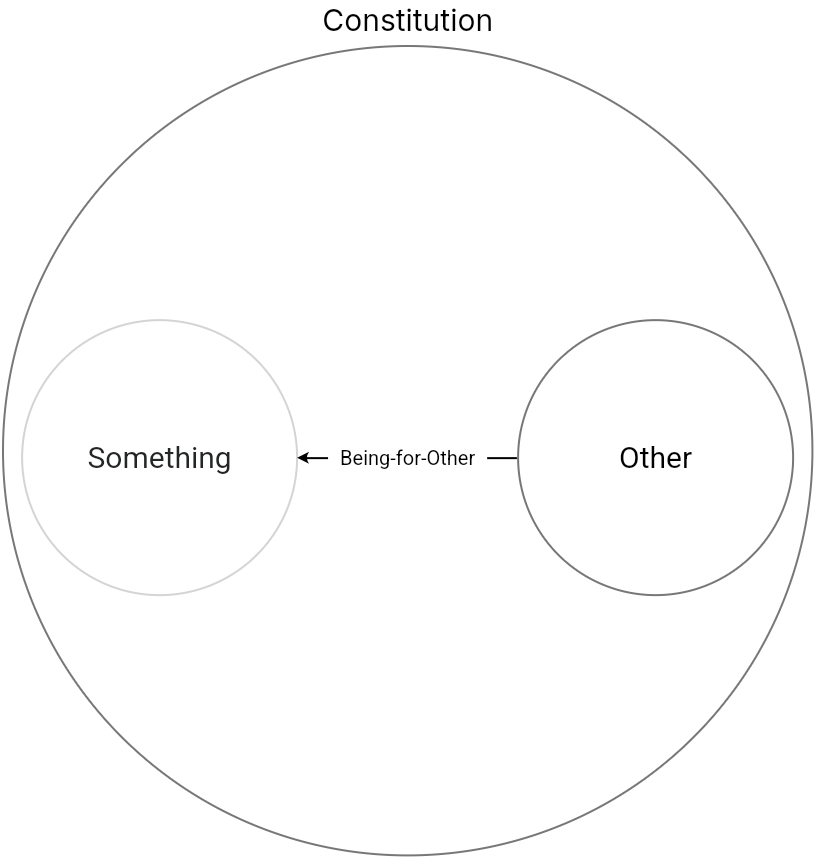
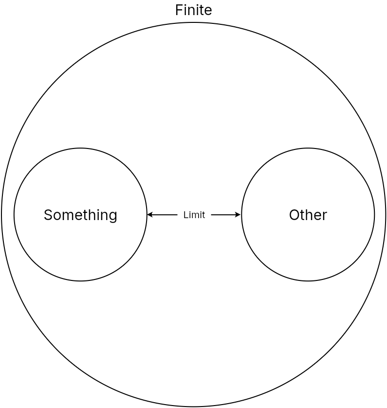

In the concept of finitude, it is not being and reality, but rather non-being and negation that constitute presence. Presence only is through the other, i.e., through the fact that it is not being the other. But if we ask which aspect of it is the predominant one, there is no question that it is not a multitude of things. The finite is, so to speak, shot to pieces by a multitude of negations and riddled with holes. This reduction of being by negation is determinateness, and it is clear that every determinateness is a negation, as the negation of the fullness of being. But even in determinacy, a remainder of the positive is still preserved, just as the negative in being is not yet completely explicit.

#### Limit

The point at which the finite terminates and becomes other to itself is the limit. To be limited is the innermost nature of presence, and the demonstration of its determinateness is therefore its definition. Since negation constitutes presence, its limit does not fall outside of it, rather its limit is inherent to what it is. For instance, in the square, each line that limits the square is part of the square itself, its presence and limit are one and the same. 

#### Quality

The limit of presence expressed as what it is, as its positive being, is a quality. The quality is that which is in the being of something. In it, it becomes apparent that to be for something else is what constitutes the being-in-itself of presence. For the limit, the outer boundary of presence, is its being-in-itself. Red and green are qualities that are only so in relation to light. What makes something red or green has this quality in themselves, but it only exists as quality when it is placed in this relation to another quality. This being-for-other of quality is constitution. But it is again one-sided to conceive quality only from this positive side, since it is what it is only through the exclusion of all other qualities. This color is red only because it is not a color that is not red. The negation of the other qualities is what makes this quality a being. The quality of being thus excludes all other qualities as non-beings in themselves and so finite things are what they are only through exclusion. 

But if the limit, as the negation of presence, is at the same time its true position, then the exclusion of limit is not merely a negation, but is likewise a unity of being and non-being. For just as the limit turns its in-itself as a quality outward into presence, so exclusion, as only being-in-itself, turns its being inward. The negative quality is present in the positive only in itself. Red is green in-itself, but does not have this quality as its quality, but only as its determination. The determinacy of quality is that from which constitution and determination appear as their moments, and in which they are also immediately included. What is left to consider, then, is the development of these moments, that of the transformation of the non-existent into presence and vice versa.

#### Qualitative Change

That in presence and in reality its opposing moments have collapsed in determinacy, we have already described above as a one-sidedness and dialectic has now reached the point where the postponed struggle appears once more. For if the finite is that which has an end, then it was one-sided to grasp the limit of presence only as its being. Limitedness must simultaneously assert itself in it as its non-being. Even if its limit thereby also remains being, this being of the limit is nevertheless not the being of this presence, but of another. The limit, as the negative quality or deprivation, becomes, passing over into being, a positive quality, and the previously existing quality becomes negative, becomes a limit. This transformation of quality into limit, and thus of limit into quality, is qualitative change. For instance, the green leaf turns yellow in autumn and sour grapes turn sweet. Through the transition to a different quality, they show themselves as what they are. Because something has the other in-itself as its determinacy, this other, which is merely non-existent in something, transforms into it and becomes something else. The qualitatively changeable is the instability of the finite, that it is defined by otherness means that it can never escape it. Becoming thus reappears in what has undergone qualitative change, or rather, the concept of becoming was always there to begin with, only now it is explicit. For being and non-being are always opposite and merge into one another, only that one doesn't always notice this until well after change has taken place. We now also clearly recognize that nothing arises or passes away absolutely, since everything is in a state of eternal becoming. For when something comes into being from another through a qualitative change of quality, only this quality arises, and the previous one perishes. While one quality transforms from being into nothing, the other transforms from nothing into being. But the one that has passed into nothing retains its being in the hope of further transformation and the one that has attained being will eventually have to give it up again. Thus it also becomes clear from this perspective that eternal becoming is never a reversal of the simple categories of being and nothingness into one another, but rather the pair of categories always participate in this movement, since the identities of being and nothing in qualitative change only reveal one or the other of their moments more.

If qualitative change, however, is the highest revelation of the finitude of presence, then this is also the moment when finitude ceases to be, transcending its limitation. Taken to its extreme, everything transforms into its opposite. Through qualitative change, the finite shows that it is not only this being enclosed within narrow limits, but that it can change and become an other to itself. Qualitative change is thus the first liberation from the shackles of finitude. But if we deny the truth of changeability and call it unchanging, this is only because that in the finite a new being reveals itself alongside the first as its determination. Though the first qualitative change does not do away with the finite as such. For qualitative change is an indication of the need for change from which the unchangeable is spared. To be such is only an endeavor of the finite. With the first qualitative change, it is therefore not done with, but rather continues to change. For the determination of the finite is immeasurably more comprehensive than its constitution since this is only one determination of it. Thus, after one of the non-existent determination has entered into presence, another follows behind it. If something necessarily becomes something else because of its finitude, then this other, because it is also something, is equally driven to become something else again and so on. It is the same whether something is said once or always, for it we only need to express it once for it to always be. Thus, the finite is destined for infinity.

### Infinity

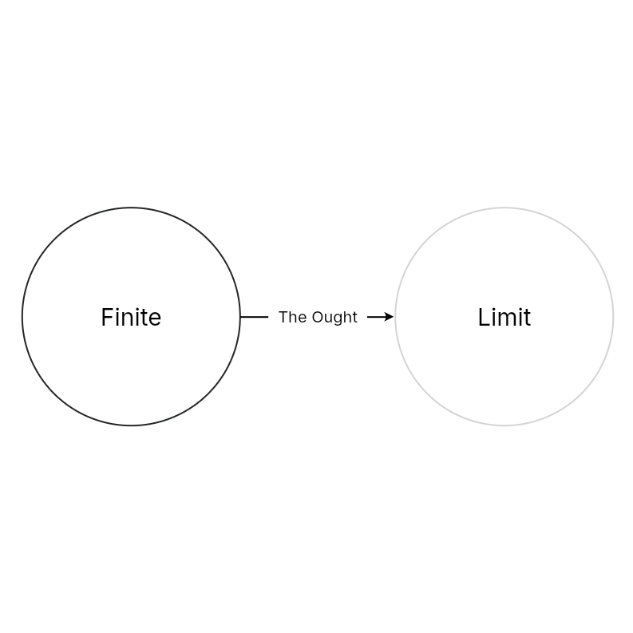
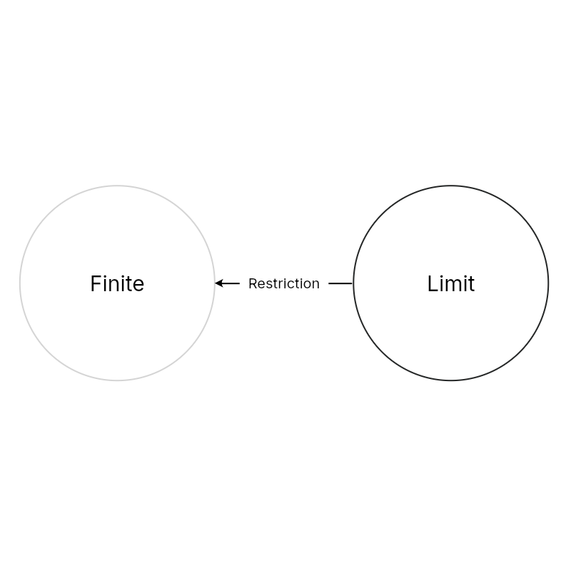
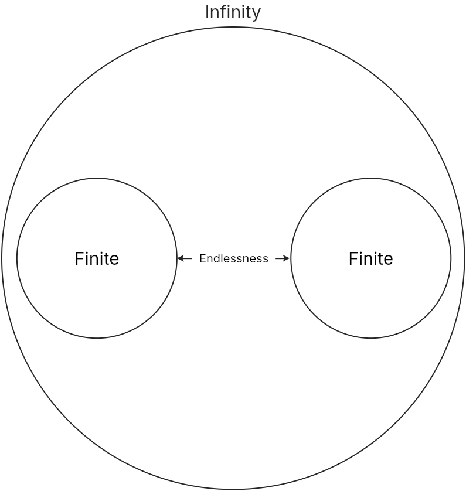

Infinity is the unity of reality and determinacy in that every determination of the finite has now become a reality. However, the falsehood that the infinite is the sum of everything finite has not yet been eliminated. This idea of infinity would never become a reality since the combination of the finite is still a determination of it. The finite seeks the infinite through constant change, but since the amount of changes the finite must go through are infinite, it only progresses from one finitude to another without ever reaching true infinity. This progress towards infinity that never arrives at anything other than finitude is the spurious infinity or endlessness. The finite has thus passed from the unity of presence into the rupture of this unity. The finite is thus limited to an eternally unsatisfied longing for the infinite, and that is precisely its misfortune, to vacillate back and forth between both states, never being able to unite them.

#### The Ought

The determination that incompletely realized is the ought. The finite is supposed to reach its determination, which is infinity, but it proves incapable of doing so because in the progression towards the infinite only a series of finitudes are realized. And even in realizing a new quality, it can even lose the qualities it has already acquired. The ought is therefore a determination that does not exist and is eternally destined not to exist. The categorical imperative in morality: "You ought, because you can" therefore contains the contradiction of precisely not being able to, precisely because the I only ought to. Moral perfection is impossible because the ought that the I conceives is the incompleteness of the moral law.

#### Limitation

But it is not only determination and quality that contradict each other. The ought is in itself a contradiction in that, on the one hand, it realizes the determination through every change to which it is driven into presence. Since the reality into which the ought passes from non-real infinity is itself only a finite quality, it, on the other hand, reverts to a finitude inadequate to the determination. In this constant alternation between finitude and infinity, however, one thing is clear: because no quality has yet been the adequate realization of the ought, one must always go beyond each such quality in order to try whether a new reality might not finally fulfill this ought; which, of course, remains a futile attempt. But if the determination should be, and not is, then it turns out, rather, for the particular quality of presence at any given time, that it is, and should not be. Such a limit of presence, which is to be abolished, we now call the limitation, the knowledge of the ought not to be. If all other finite beings are only limited, then man alone knows his limit as a limit since he is conscious of his limit as well as his desire to go beyond it. However, the limitation, in its abolition, only sets a new limit, which again must be abolished, thus, the infinite progress is now to be understood as the constant alternation between limit and ought, which likewise seems incapable of reaching any result. Dialectics must now remedy this new contradiction.

#### Self-Determination

Since the limit into which the ought sets itself is the determination of the ought itself, it is not a limit for the ought, but is its realized self-limitation. The ought ceases to be non-existent, it is in this determinacy. At the same time, the ought is also not bound to it, but by setting a new limit, it realizes another determinacy so that it determines its determinations. The infinite determines itself by being what sets and transcends limitation. Self-determination is not limited by limitation because it cancels out its own determinacy and is exalted above it. Self-determination is not only realized in the infinity of determinations, but it is complete in each moment because each determination is the self-determination of the infinite at its limit. The process of negation is negated and returns from mediation to back to immediacy in order to continually determine itself in each one. The infinite now no longer has a limit in the other and is not for it, but has other included in it. This being-in-itself in the other is being-for-itself.

## Being-for-Itself

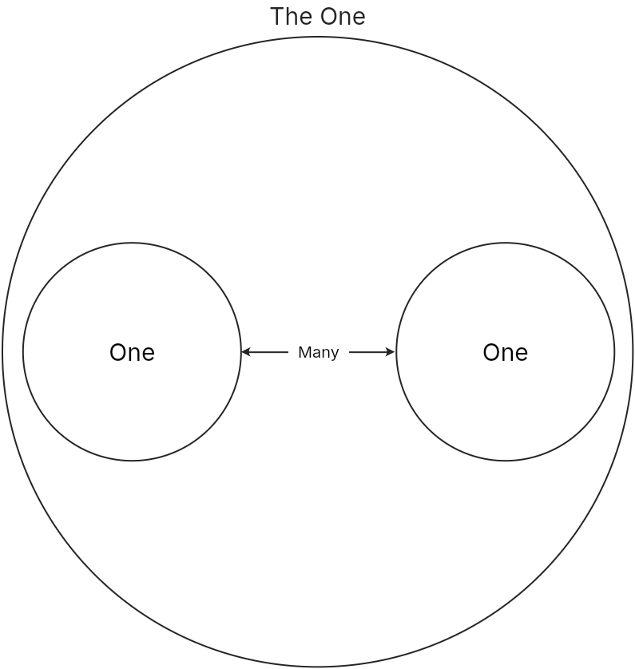

Only with being-for-itself is the true infinite attained, or the infinity of reason, as Spinoza calls it. That infinity is immersed in every finite being not only reveals its nature through the series of finites, but also in the unchanging truth that persists through eternal change, whose self-negation is at the same time a self-affirmation. As this self-affirmation, the infinite is from itself and through itself, and everything finite is contained in it. To consider finite things in this way means to consider them under the image of the infinite. The existing oneness of all finites in the infinite is its ideality.

### Unity

The ideality in which all determinations are related is unity. Unity is a necessary quality of truth, not in the sense that oneness is one of its predicates, but rather that the unity of all determinations is the whole truth. According to this, all things are contained and resolved in unity. Everything finite is merely a moment, sublated and thus preserved in the infinite. The infinite is the ideality of all things not only in the sense that the ideal is in each one, but also in that the real unity of all things does not truly exist. Being-for-Itself has nothing other to it, so it is one.

### Plurality

The mere negation of finite things, however, is again only a one-sidedness. Unity is not an abyss into which the others merely disappear, it is an active unity or unifying activity. Since the infinite is defined as the negation of negation, in order to negate the negative (e.g. the determinate or finite), it must be posited that the negation of one limit is the positing of another. The activity of uniting, which is the sublation of the other, is thus also the positing of the other as the one's own determinacy. Put another way, the one thus posits itself as an other and each of the others posited by the one, as containing the ideal infinity in-itself, are each themselves a one. This one, eternally springing forth from the unity which continually repeats itself, is now plurality or the many, where each of which is a one. Only in the many is the one truly one, i.e. as the unifying principle of activity.

But if the category of the many is grasped as the negative moment in its separation from unity, then each of the many appears precisely as an imitation of the unity. For since the ideal unity is already contained in each one, each posits the other in-itself just like the original one. Each of the many, as a one, wants to be for-itself in the other. But since everyone expresses this imposition toward everyone else, each excludes this encroachment of the others from itself and so each remains in its own abstract self-presence without being one with the others in-and-for-itself. Because plurality has no limit, it becomes an endless multitude devoid of connection. Just as it was one-sided to make the abstract unity beyond the many into a principle, it is no less one-sided to make the endless multitude beyond unity into its own principle, as atomism does.

### Totality

The many, however, cannot maintain their self-unity and remain completely separate. Since each wants to exclude itself from the others, and the others want to be excluded from it, this is an activity which is common to all of them and in this respect they do not differ from one another at all. Furthermore, they are not even capable of excluding one another because they are all one and the same one. That each of the many excludes the others from itself can therefore only mean that it excludes them as others from itself, thus negating precisely the aspect of their finitude, and because this outer shell of exclusion has vanished they are all the more united. Each of the many is in fact the original one, which ideally includes the others within itself. No one has the advantage over the others in being the sole principle of unity. What is difficult grasp is that not only does unity persist in fragmentation, but that because unity is the unification of the many, multiplicity persists as well. The preservation of unity in multiplicity and of multiplicity in unity is totality.

It is a correct to say that the highest principle of quality is totality, for this category is the truth of ideality. But ideality carried to its extreme turns into its very opposite. For on the one hand, totality, as an ideal totality, is only the simple, undeveloped unity: as realized totality, only multiplicity fragmented into infinity. And totality, although the encompassing unity of the two moments of unity and multiplicity, cannot yet achieve their complete interpenetration, but always falls apart more as the sum of the many. Precisely because each of the many have become one, expanding itself into absolute self-presence, it has become free from all others and from its relationship to them. The many ones are indifferent to one another, and despite this indifference and independence of the many, they are completely equal. This contradiction that all ones are absolutely everything that the other is, but which nevertheless fall apart absolutely and without relationship, is the concept of quantity.
