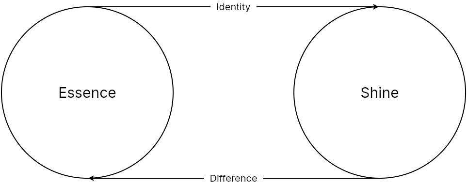
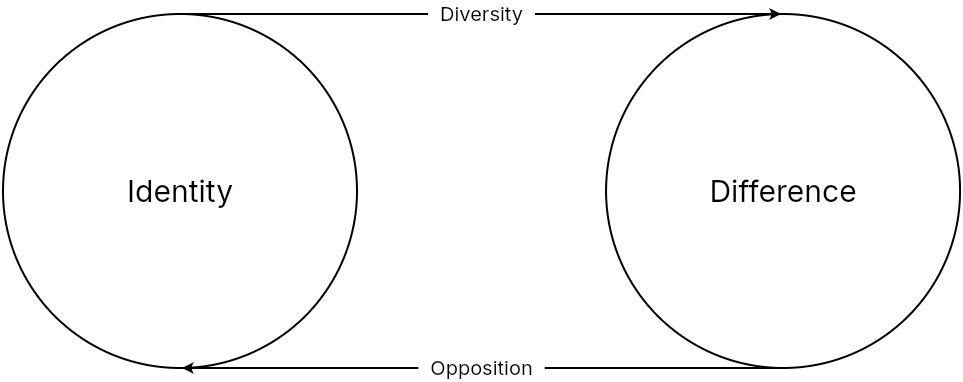
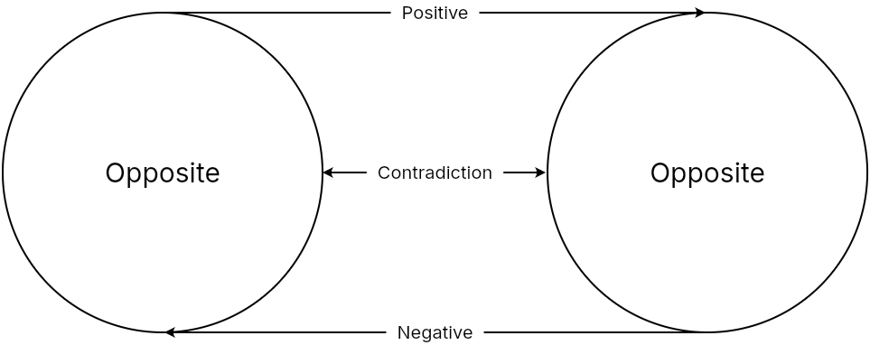
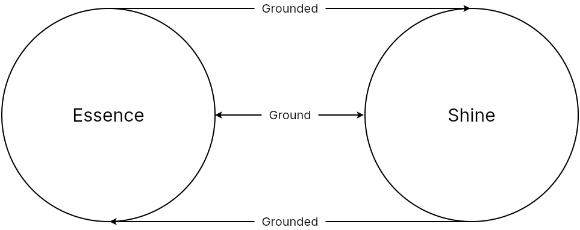
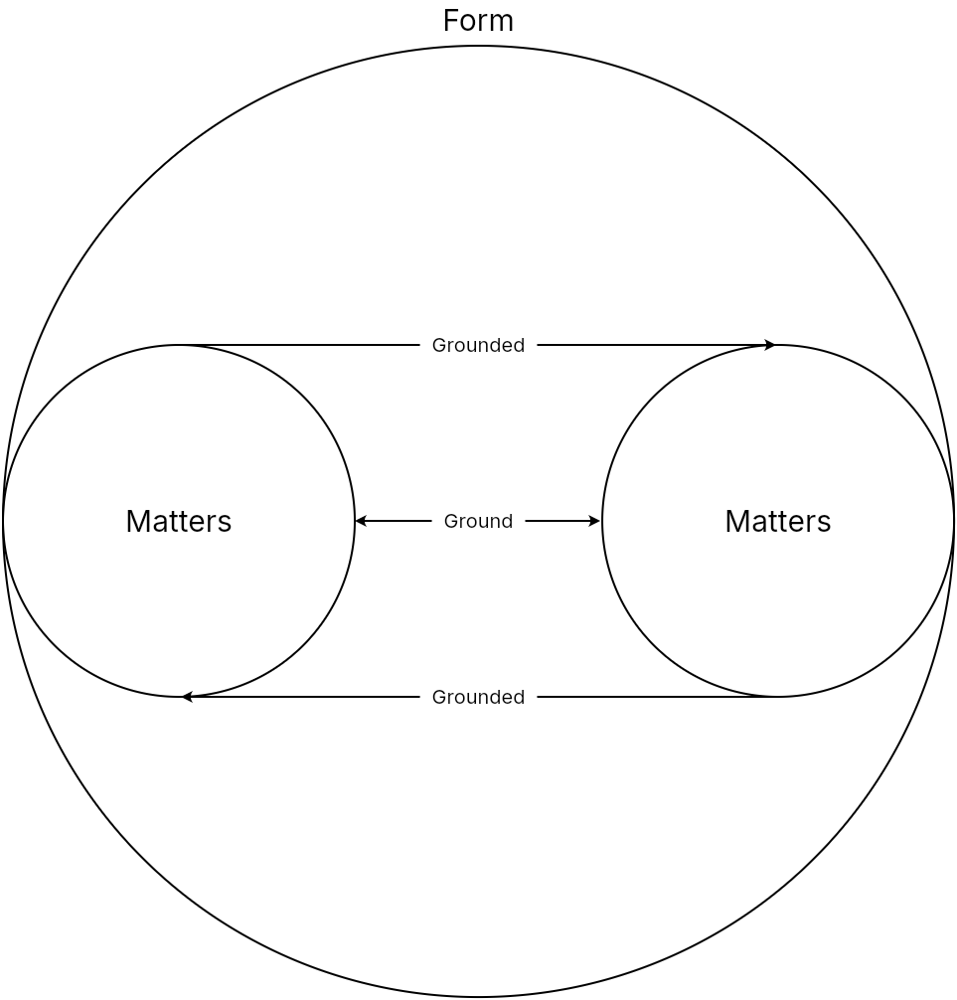
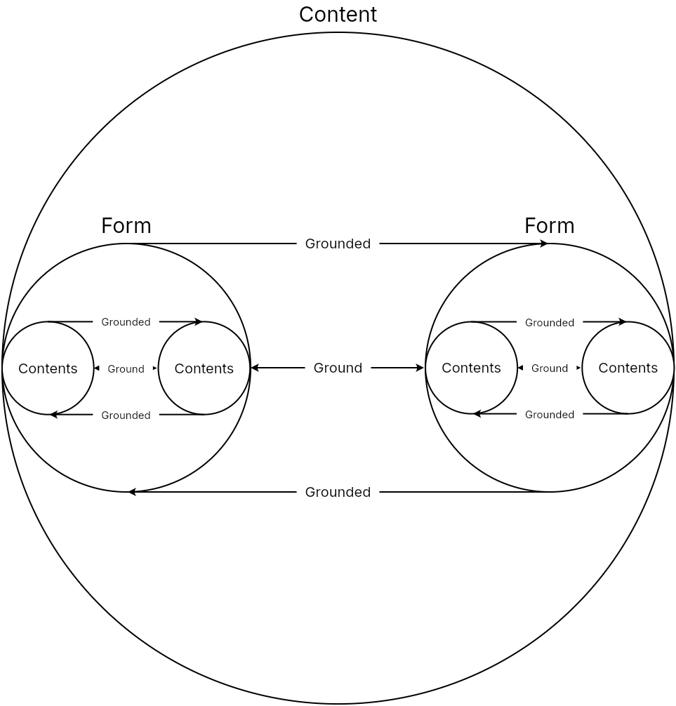

# Reflection

Note: This webpage is a translation of Karl Ludwig Michelet's *Encyclopedia Logic* (1876) 

The mode of progression in Essence is entirely different from that in Being. In Being, something always passed over into something else—whether that something was a quality, quantity, or measure. Essence, however, as all-encompassing mediation, can no longer pass over into something else. Instead, it posits the other as *its* other—it posits its interior as its exterior, but only through this positing does it show (shine) what it is. This process of becoming external is a matter of arriving at itself, just as in the case of *degree*, quantity emerged from its state of indifference to itself and found itself again in the form of *measure*. Yet, whereas that measure became a *different* measure because it was simply one ideal determinateness defined against others, the indifference of Essence allows it to remain *independently* defined amidst any externality, because Essence encompasses within itself the infinite determinations of Being. Due to the infinite simplicity of Essence—which contains all that *is* simply as something ideal—that which *is* is also contained within it as *not* being, that is, as something that *was*.

The goal toward which Essence strives in its progression is to eliminate the posited opposition between Being and Essence, and that Being should be fully restored as something born of Essence, something that is fully present and reconciled with it. Thus, we must consider the first moment of Essence as Reflection, that inner realm that is indeed the ground of Being, but holds Being enclosed within itself. The second moment of Essence is that Being that arises from this inner ground of Essence, standing in opposition to its ground, it appears as something posited by it. This Being—detached from Essence as its product—is *Appearance*. The third moment of Essence—as Essence reconciling itself with Being within the standpoint of Essence itself—is *Actuality*. These three moments of Essence correspond exactly to the three moments of Being: Reflection is the indeterminate, undisclosed pure Essence, Appearance is the *Presence* or determinate existence of Essence, and Actuality is the Being-for-Itself or Essence that is with itself in its other (Being).

Since the nature of Essence—arising from the movement to withdraw all Being into itself—is to supersede Being by rendering it *inessential*, and since Essence is itself nothing other than this movement of Being becoming inessential, the positing of Being as inessential is actually the movement of Essence itself. In reducing Being to a Semblance, Essence first breaks forth *within* that Semblance. The movement of Essence is therefore a *shining* within itself, namely, the positing of Being by Essence. But since Essence is not a Semblance, and the Essential is not the Inessential, Being still appears to Essence as something presupposed—something into which Essence has lost itself. However, since Essence has become Essence only through the negation of the presupposition it posited for itself, it has truly *become* itself only in this negation, for without the Semblance, Essence would be nothing. This movement—returning into itself from its other, and only through this return becoming Essence (and thus positing Semblance *out of* itself)—this vortex or counter-thrust of Essence into itself is what we may call *Reflection*, akin to light reflecting back from its other—a smooth, dark surface—upon which it shines. Thus, while in the realm of Being, the series of immediacies advances ever outward, Essence is *immediate* only through the *mediation* of immediate Being.

As for the division of Reflection: since all Being is a Semblance within it, Essence is firstly identical with itself. However, because this Semblance is simultaneously Essence positing itself as its own other, Essence secondly contains difference within itself. However, since what is presupposed is actually posited by Essence, and its difference arises directly from its identity, Essence thirdly constitutes the ground of Being, it reflects itself within that which is grounded, thereby restoring itself from its own loss.

## Identity

Having reduced the many independent moments of being to dependencies, identity is this unity that presents itself in the dependent many. In the semblance of the many determinations, essence is what remains the unaltered through all alteration and unchangeable through eternal change. This does not mean, however, that identity exists outside of what it posits, for it is the very connection that unites all being. Therefore, identity cannot be an empty formalism, but is the very fullness of content itself presented in the form of simplicity. Since that which is posited by identity is the non-identical, identity is thus the identity of identity and non-identity, for what is identical to itself is not identical to another.

The categories of essence have been primarily fashioned into laws of thought, or general principles that guide all understanding. The first law of thought is the law of identity, or A = A. That everything is identical to itself is certainly true, but it is also redundant to the point of meaninglessness. Anyone who speak in sentences like this communicates nothing and only makes themselves look ridiculous. By omitting non-identity, the statement becomes not only meaningless, but the opposite of the truth. For if, at the beginning of the sentence, it is stated that "A is", we demand something other than the A be posited to specify what A really is. Therefore, the law of identity taken to its logical conclusion is that everything, having omitted everything inessential to identity, is identical to everything else.

That everything is simultaneously identical to itself and identical to everything else can only be grasped dialectically as one thought. This is only possible if the identity that is identical with itself in all things also presents itself in each thing that is not identical. In other words, the non-identical aspect of identity is that of internal distinction, or identity that has difference within itself. The identity that pervades everything distinguishes itself from itself in each one. As essence negates itself into a semblance, so too does identity negates itself into difference. This semblance of essence in itself, as its reflection, posits this negativity within itself. Reflection now reveals itself as the distinguishability of identity, only through the separation of differences does identity become identical to itself.

## Difference

Difference first appears as something independent of identity and therefore excluding it. The difference that is excluded from identity is revealed to be diversity. But the fact that its other, identity, is also posited in the difference makes it an opposition. The struggle between identity and difference to distinguish themselves from one another is contradiction. These moments of difference must now develop through its own dialectic.

### Diversity

Since essence contains of all determinations of being within itself, it also posits them as its moments. However, because they are moments, they also differ from one another. Through the diversity of reflection, all determinations are indifferently distinct differences. Every different thing is indifferent to all others. But they are not merely, as in being, others to one another. They originate from essence, so they also have identity within them. This identity, however, is just as indifferent to them as the difference was previously. But if identity and difference are indifferent to the different things, then both aspects refer back into a third that mediates them, which is comparison. Whenever two things are compared, their relative identity is their similarity and their relative difference is their dissimilarity. In comparison, similarity and dissimilarity are simultaneously posited in things as an inseparable unity. For two things that are dissimilar are also similar in their dissimilarity. e.g. yellow and blue are different colors, but are the same as colors. Every dissimilarity presupposes a third element of comparison which is their essence.

Thus, every different thing is similar to every other in one respect, and dissimilar in another. Difference has now been elevated to a law of thought, just as identity was before. This second law of thought states, "All things are different", which is already a complete negation of first law, "All things are identical". The formal understanding tries to escape this contradiction of identity and difference by keeping two opposing predicates completely separate from each other. A is identical only to itself and is different from everything that is not-A. However, since every thing contains its opposite, the principle of identity has already failed to prove itself. 

### Opposition

With this, however, identity and difference have ceased to be external to diversity, they have become the very determinations of the difference itself, thereby raising themselves to pure opposition. Essence precisely includes its opposite within itself as an external reflection, the positing of itself from its identity into its differences. While each of its differences seems able to exist without the other, the opposite exists only because its other also exists, they are also correlated in that one is inconceivable without the other. Identity is only the identity of its differences, thus containing its opposite immediately within itself, whereas unity could not unify plurality in any meaningful way. Likewise, difference is only a difference of identity, not a plurality that lacks unity. Since all being is a positedness of essence, everything is also opposed to itself and contains its opposite. However, the formal understanding keeps the terms of opposition completely separate from each other. The principle of opposition in this way becomes: "Of two opposite predicates, only one belongs to a subject, not the other." According to this, every thing is either this or that, there is no third. 

Even if it is admitted that many opposites exclude each other, such as right and left, it remains no less true that they inexorably demand each other, and one absolutely cannot exist without the other. One can only designate something as the left side if there is also a right side. Indeed, right and left are something entirely relative, and they are exchanged for each other when my point of view is mirrored. Thus, the principle of the excluded middle collapses, the exclusion of the either/or is itself excluded, since right is also left and positive is also negative. Between +a and -a, a itself is this excluded middle. This third appears as a middle because it places itself between the opposites without combining them, just as the vertical axis is the third between right and left.  The middle connects the two opposites, but also places itself between them without abolishing their distinction, just as gray is the middle between white and black, and color is the middle between light and dark. Reason is the positivity established by the negation of the negation, and thus is also what connects the opposites that it allows to exist. But if in opposition each of the elements are still excluded from each other, it is nevertheless in the nature of the opposition to have its other within itself, just as the essence itself is that which distinguishes itself, and the difference itself is that which identifies itself. These oppositions are inherently opposite, but even if in existence we mostly find opposites separated and opposed to one another, we nevertheless also frequently encounter them together.

Finally, there is the general opposition between that of truth and error. It has been said that every error contains something true and that there is no such thing as error per se. Indeed, if the formal understanding distinguishes between opposites, the error lies in taking one side of the truth to be the complete truth. The truth is the whole, and the whole consists uniting each side under the context of a third thought which connects them by abolishing their separation. So it is not the case that truth contains a double error, but just as affirmation arises from the negation of negation, so does truth arise from the negation of error, whose sides cannot be conceived not as an either/or or neither/nor in order for both conceptions to perish in the both/and of truth. The true is the third, which is the knowledge that is sought in philosophy. However, there is only one case where formal understanding is completely right to exclude this third. For in the dichotomy, the terms of the opposition are already defined to be mutually exclusive to each other (e.g. on or off, alive or dead, action or inaction, etc.). 

### Contradiction

Two opposites that presuppose and require each other in one and the same thought is a contradiction. Essence is a contradiction as it only appears as the positing element in its posited nature, finding its identity only in its differentiation from itself. Since essence encompasses all being within itself, contradiction exists everywhere in being. For instance, motion is the contradiction of the simultaneity of place and time. Life is even more of a contradiction in that the acorn is an oak and is not, and germination is the process by which this contradiction is resolved. Every drive is feeling of lack and satisfaction, which is what creates the striving from the one to the other. The collision of law is contradiction of duties, for instance, sacrificing familial duty to national duty, like Creon, or conversely for Antigone, since the same contradiction is contained in both. History is the contradiction that the purpose of humanity, already implicit in the beginning, is only realized at the end. 

Contradiction is therefore not something illusory or unreal, but is the very source of all activity, progress and development. But truth does not remain a contradiction, rather the contradiction contradicts itself in being a contradiction. The tree contradicts itself in the seed because its existence does not yet correspond to what it is in essence, yet it still breaks the contradictory shell in two and develops out of its contradictions as it shapes its own existence. This creative essence is the ground from which the entire fullness of being proceeds as a consequence, but in such a way that it does not actually expel itself and remains enclosed within it as essence. 

The reason that the principle of contradiction remains so difficult to grasp is because of the sheer aversion or allergy that formal understanding has towards it. To say that nothing contradicts itself restate of the law of identity, but in a negative form. It is possible to ascribe a static correctness to this identity, but it is completely false dynamically since everything becomes its opposite in becoming also means that everything contradicts itself. 

While the formal understanding rightly demands that the many adjectives describing a subject be compatible with one another (principium convenientiae), it is also in the nature of things as semblances to contradict themselves because they are precisely not perfectly in congruity or equivalent to what they are in essence. Because the essence is already within the thing, the semblance is powerless to the activity of the essence breaking out of its state of contradiction and returning it to its ground.

## Ground

Ground, as the third category of essence which includes identity and difference, is an irrefutable characteristic of truth. According to the principle of emanation, everything is an emanation of a highest principle, which can also be called its foundation. All reality would then follow as a consequence of this foundation. But if we distinguish the world from its foundation in this way, then both the foundation and the world seem to be deficient in that it implies the foundation is transcendental to the world and thus cannot be deduced directly from it or vice versa. The foundation identifies the totality of being, but reduces everything to it, whereas the world is the very unfolding of multiplicity, but remains fragmented without anything to identify it. Only the comprehensive unity of ground is capable of unifying all these differences out of itself.

Ground, like the other categories of essence, also has its own law of thought, the principle of sufficient reason. The formal understanding has no other option but to accept this law of thought to be completely in accordance with reason. For the proposition means nothing more than that all distinctions explicated in beings has their ground or reason for being. To even call it sufficient reason is somewhat redundant because sufficiency is already a quality of reason. Yet ground cannot be considered in isolation from what it grounds.

### Matter

If these moments are understood one-sidedly in isolation from each other, then ground would certainly be reduced to a form of understanding previously found erased from it. Ground, as the identity of difference, is essentially the indeterminate ground or foundation of being, its basis. It is still highly one-sided to want to make the existing foundation the only ground of the world, as e.g. a materialist metaphysics would argue. However, one does not see how difference could be derived from an empty foundational claim, regardless whether it begins with ideas or matter or whatever else. In fact, an actual ground is not empty at all, since identity is only an identity in the positing of difference. Therefore, all difference is already contained in the basis for something, even in cases where ground and grounded are indistinguishable. Likewise, the basis is capable of generating all of these differences from itself. And since ground in general is the activity of grounding being, the basis is not only capable of positing differences from itself, but actually has within itself all the determinations of contradiction.

### Form

The determinateness of the basis is its form, the formal ground. To designate ground as the activity of grounding being cannot be reduced to an indeterminate identity, for this is the passive material in which only form, as the active element, posits the differences. If the matter is subject to change, then its form is what drives it to change, through which it passes from one difference to another. But since each form excludes the other, in that they contradict each other in the basis, it is the negative moment of ground. In other words, this brings the new perspective that things are what they are only through their absence, since the positing of one form is the absence of another. As the active ground, however, form is just as much the carrier of differences, and is the entire foundation itself that includes the forms. But if form, since it has matter in itself, can no more be thought of as being beyond matter than its basis, then it cannot be thought of without them. It is just as one-sided to make form the sole ground of things as it is to make matter. Because of this inseparability of form and matter, we have only materialized form or formed matter. The unity of opposed moments of ground is content.

### Content

If matter and form present both present themselves as ground in the content, we cannot consider the content that appears from their connection to be the grounded. For this totality is presupposed by its consequence, or stated differently, the entire content of the consequence is already present in the ground. The one and the same content that appears in the form of the grounded also appears in the form of the ground. So the ground and grounded have themselves become the form of the content. The content is indifferent to the ground-relation, and the essential to this form. If essence is preferred to form, because it only in the determination of form that essence come into its own, then the content, because it connects matter and form, is the highest. What actually matters in philosophy is content and the knowledge thereof. The question of why gives way to the question of what because the what implies why in the same manner that the content implies its ground within itself. This what, the content-filled essence that returned from the form of ground to its existence, is the appearance.